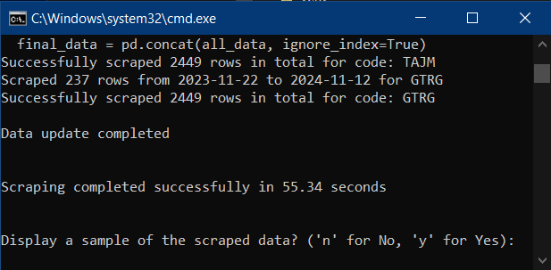
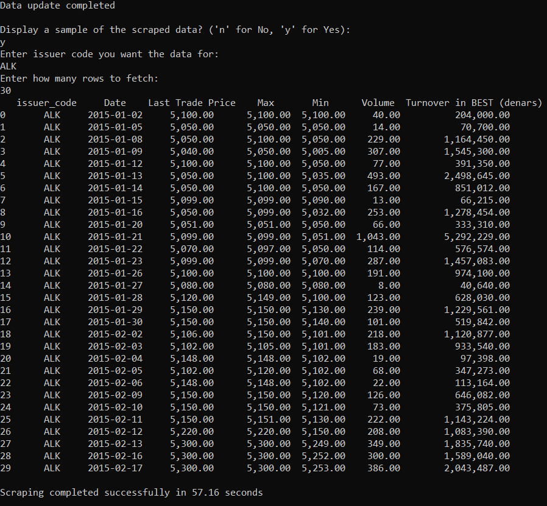
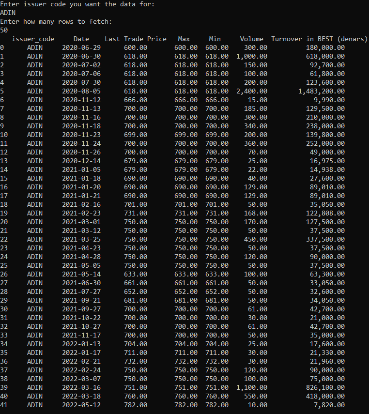

# Macedonian Stock Exchange Data Analysis

## NOTE: The commits after the deadline were made because the MSE website had changes to the dropdown list that contains all of the issuer codes, rendering the entire program useless without changes to how the issuer codes are retreived. The teaching assistant was informed of this and approved of the changes which did not change the architecture of the code (Including this readme file along with proof of the runtime).

## Project Description
This application automates the collection and processing of historical stock market data from the Macedonian Stock Exchange (MSE). At its core, the application implements a Pipe and Filter architectural pattern, where each component acts as a specialized filter that processes and transforms data before passing it to the next component through pipes.

The pipeline consists of several key filters:
1. **Issuer Extraction Filter**: Retrieves and filters issuer codes from the MSE website
2. **Date Validation Filter**: Checks existing data and determines required date ranges
3. **Data Retrieval Filter**: Fetches missing historical data for each issuer
4. **Data Processing Filter**: Formats and validates the retrieved data
5. **Storage Filter**: Manages database operations and data persistence

Each filter operates independently, handling a specific aspect of the data processing workflow while maintaining loose coupling between components. This architecture enables efficient data flow, parallel processing capabilities, and easy system maintenance and scalability.

The system systematically retrieves, processes, and stores daily stock market data for all listed issuers over the past decade. Through automated data updates and strict validation, the system ensures data integrity while avoiding duplicate entries. The implementation leverages multi-threading for optimal performance during data retrieval and processing operations.

## Execution time

execution time  = 55.34 seconds



## Requirements

### Functional Requirements
1. **Issuer Data Retrieval**
   - Automatically fetch all listed issuers from MSE website
   - Filter out bonds and numerical codes
   - Extract issuer codes from the dropdown menu

2. **Historical Data Management**
   - Retrieve historical data spanning at least 10 years
   - Check and store the last available date for each issuer
   - Update existing data with new entries

3. **Data Processing**
   - Format dates consistently (English format)
   - Format prices with proper delimiters (e.g., 21,600.00)
   - Validate and clean data before storage

4. **Database Operations**
   - Check existing data for each issuer
   - Identify and fill data gaps
   - Prevent duplicate entries

### Non-Functional Requirements
1. **Performance**
   - Efficient data retrieval and processing
   - Minimal system resource usage
   - Reasonable response times for data updates

2. **Reliability**
   - Error handling for network issues
   - Data consistency checks
   - Recovery from interruptions

3. **Maintainability**
   - Modular code structure
   - Version control

4. **Usability**
   - Simple and automatic setup process
   - Clear error messages

## System Architecture

### Class Structure
1. **IssuerCodeExtractor**
   - Handles web scraping of issuer codes
   - Filters invalid codes
   - Uses Selenium for web automation

2. **DatabaseManager**
   - Manages SQLite database operations
   - Handles data insertion and updates
   - Maintains data integrity

3. **DataScraper**
   - Coordinates data retrieval process
   - Implements threading for parallel processing
   - Manages the scraping queue

4. **MSEStockScraper**
   - Scrapes historical stock data
   - Formats data according to requirements
   - Handles web page navigation
  
### Usage

####User Scenarios and Personas

#Persona 1: Investor Jane
Jane is a seasoned investor who closely follows the Macedonian stock market. She is particularly interested in analyzing the performance of individual issuers to identify potential investment opportunities. Jane uses the stock market analysis application to:

Monitor Issuer Performance: Jane regularly checks the application to view historical price trends, calculate key metrics (such as moving averages and price-to-earnings ratios), and compare the performance of different issuers.
Identify Emerging Trends: Jane uses the application's analytical tools to detect early signs of market shifts or changes in an issuer's financial health. This helps her make informed investment decisions.
Generate Custom Reports: Jane creates custom reports to highlight specific issuers or market segments that align with her investment strategy. She can export these reports in various formats for further analysis or sharing with her investment team.

#Persona 2: Analyst John
John is a financial analyst at a local investment firm. He uses the stock market analysis application to support his research and advisory services for the firm's clients. John's main use cases include:

Comprehensive Data Access: John relies on the application to provide him with a complete and up-to-date dataset of historical stock market information for the Macedonian exchange.
In-depth Analysis: John uses the application's analytical features to perform complex analyses, such as sector comparisons, risk assessment, and forecasting models. This helps him generate insightful reports for the firm's clients.
Collaboration and Reporting: John collaborates with his team to share data, insights, and custom reports generated from the application. He can easily export data in formats compatible with the firm's internal systems and tools.

#### Query Mode
This demo shows how to use the query mode to fetch specific data based on user input.


#### Normal Mode
In this mode, data is retrieved automatically based on predefined parameters.


### Example Outputs

- **Data Update After Scraping:**  
  The following screenshot shows a table after data scraping is completed, with updated values.

  

- **Queried Table Example:**  
  This table displays data from a query operation, showing specific fields as requested.

  


## Setup Instructions

### Prerequisites
- Python 3.12 or higher
- Chrome/Firefox browser
- Internet connection

### Installation
1. Clone the repository:
```bash
git clone [repository-url]
cd [repository-name]
```

2. Run the appropriate setup script:
- Windows: Double-click `run_for_windows.bat`
- Unix/Linux/Mac: Execute `./run_for_unix.sh`

The script will:
- Create a virtual environment
- Install required dependencies
- Initialize the database
- Start the data collection process

## Database Structure
The application uses SQLite (`mse_stocks.db`) with the following structure:
- Date: Trading date
- Last Trade Price: Closing price
- Max: Daily maximum price
- Min: Daily minimum price
- Volume: Trading volume
- Turnover: Daily turnover in denars


## Data Flow
1. Extract issuer codes from MSE website
2. Check database for existing data
3. Determine date ranges for missing data
4. Retrieve and process missing data
5. Store formatted data in database


## Contact
Filip Nastovski 221550
filip.nastovski.1@students.finki.ukim.mk
